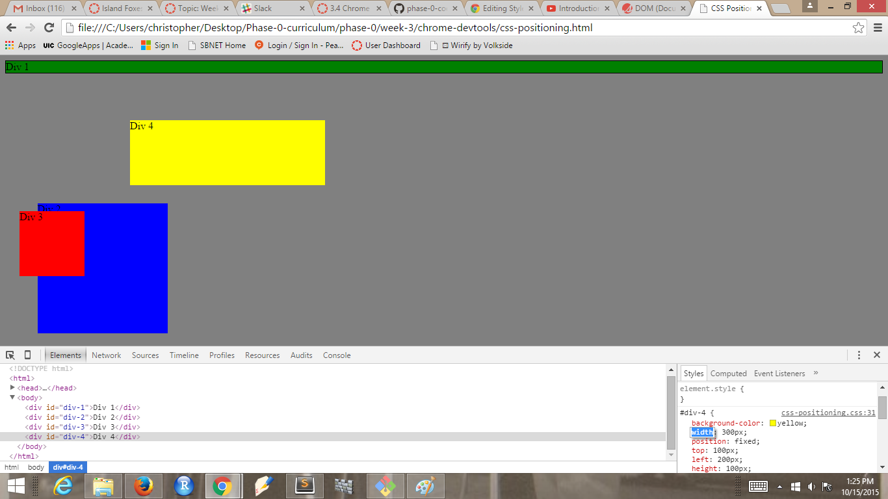
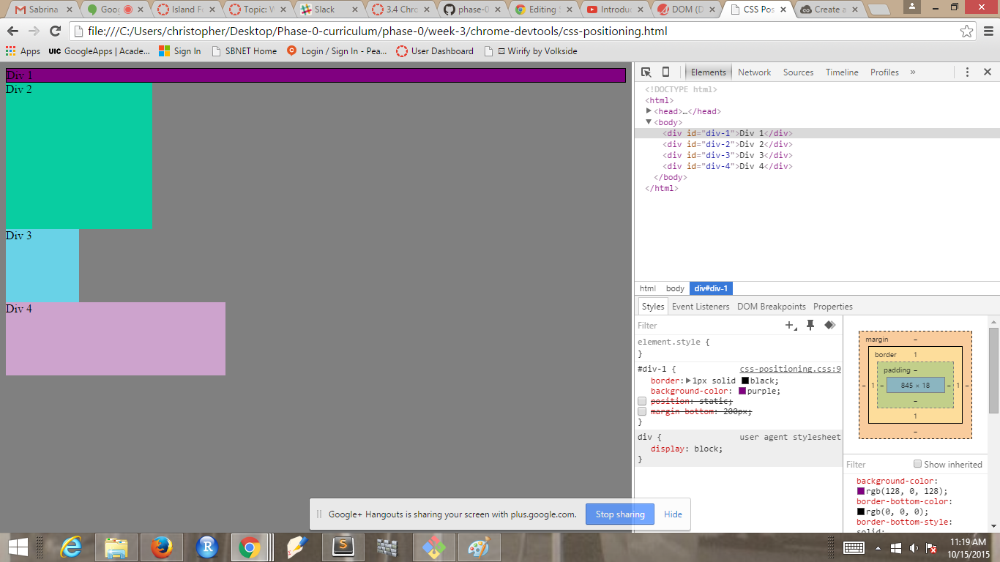
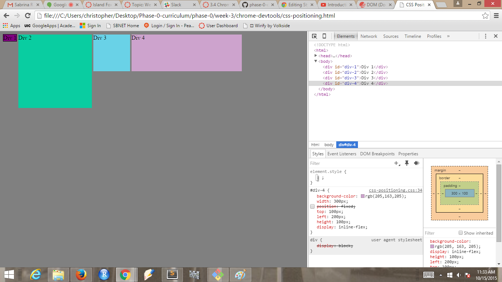
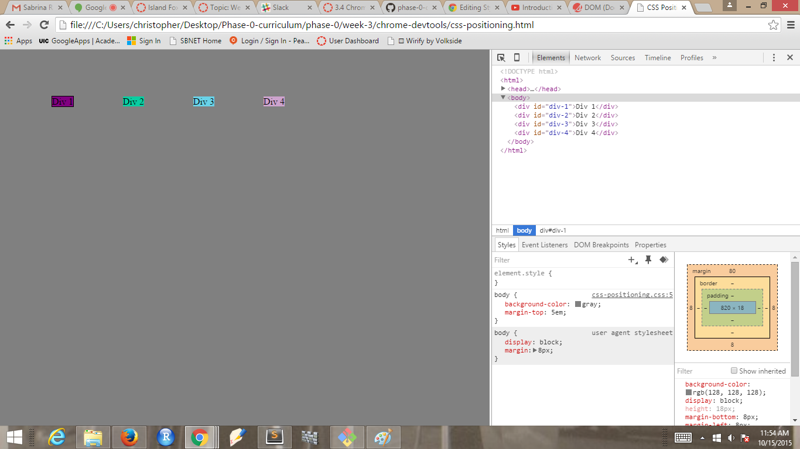
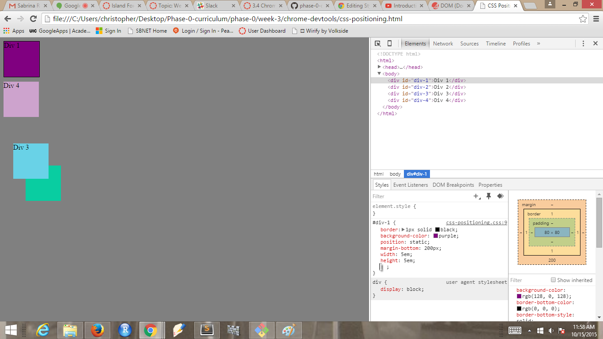
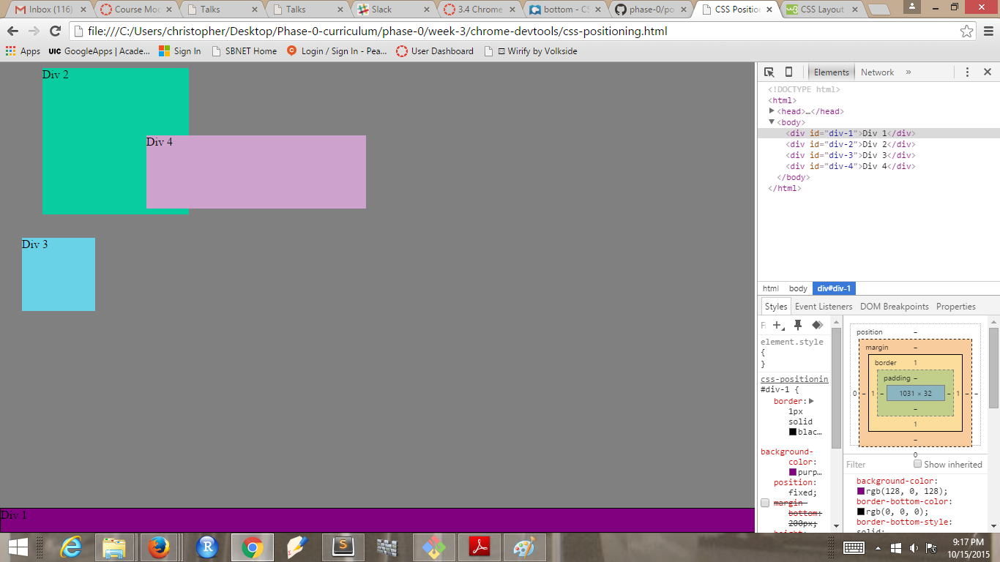
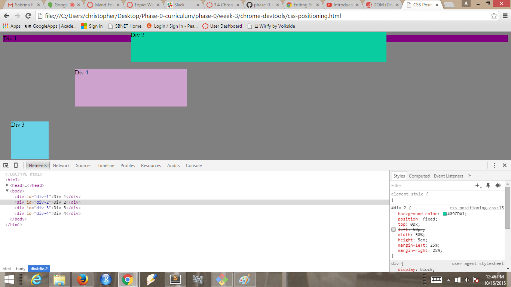
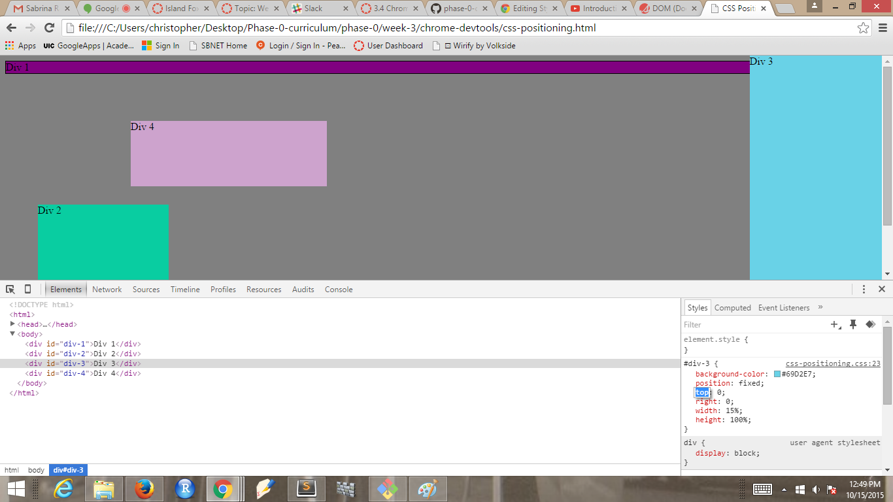
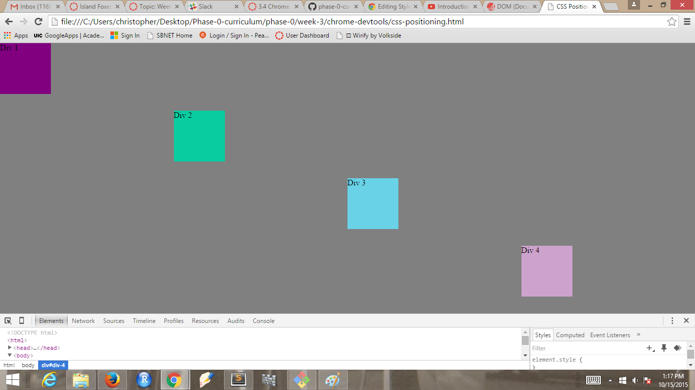

These are the screenshots from Week 3 challence 3.4:

* 3.4.1  

* 3.4.2  

* 3.4.3  

* 3.4.4  

* 3.4.5  

* 3.4.6  

* 3.4.7  

* 3.4.8  

* 3.4.9  

### How can you use Chrome's DevTools inspector to help you format or position elements?

In DevTools you can format and position elements by adding position and formatting to each element.
You can adjust values to preview the outcome before changing any actual code.

### How can you resize elements on the DOM using CSS?

You can use CSS to adjust the height and width of your elements. This can be done by expressing measurements in pixels, ems, and percentages.

### What are the differences between Absolute, Fixed, Static, and Relative positioning? Which did you find easiest to use? Which was most difficult?

 *Static* positioning is the default positioning for html elements. There are no left/right, top/bottom attributes to adjust (i.e. setting these attributes will not affect the position of the element).

  In *Absolute* positioning,the element is positioned in a location that you specify and an element in absolute position will appear on top of any static elements that it overlaps. Note that such an element is in absolute position *relative* to its parent elements.

  An element in *Fixed* position stays in its position even if there is scrolling occurring. An element in fixed position is fixed absolutely, not relative to any parent elements. The top/bottom and left/right attributes determine the element's position.

  *Relative* position of an element refers to its position relative to their position in the document flow. Setting the top/bottom, and left/right attributes of a relatively-positioned element will cause it to be adjusted away from its normal position.

### What are the differences between Margin, Border, and Padding?

A *border* is part of an element.
*Padding* is the space inside an element between the content and the border.
*Margin* is the space outside of the element.
It is thespace between the margin of the element and the margins of the other elements.

### What was your impression of this challenge overall? (love, hate, and why?)

This challenge was great! It was a lot of fun. It allowed for experimentation without worry about destroying your good code.
I wish that this challenge had come before challenge 3.3. Knowing about DevTools would have probably saved me a little of time.
My guide for GPS 2.1 mentioned that she uses it everyday on her job.

