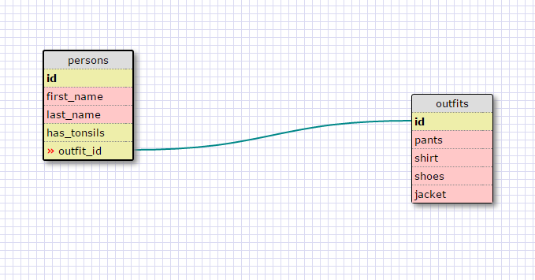

## Release 5

1.  SELECT * 
    FROM states;

2.  SELECT * 
    FROM regions;

3.  SELECT state_name, population 
    FROM states;

4.  SELECT state_name, population 
    FROM states ORDER BY population DESC;

5.  SELECT state_name 
    FROM states 
    WHERE region_id = 7;

6.  SELECT state_name, population_density 
    FROM states 
    WHERE population_density > 50 
    ORDER BY population_density;

7.  SELECT state_name 
	FROM states 
	WHERE population 
	BETWEEN 1000000 AND 1500000;

8.  SELECT state_name, region_id 
	FROM states 
	ORDER BY region_id;

9.  SELECT region_name
	FROM regions 
	WHERE region_name LIKE '%Central%';

10. SELECT regions.region_name, states.state_name
    FROM regions
    JOIN states
    ON regions.id = states.region_id
    ORDER BY regions.id;


## Release 6

Here is my schema for Release 6:




## Reflection

* What are databases for?

A database is an organized collection of data. The data is organized into tales and data can be pulled 
from various tables via sql. The tables are (supposed to be) defined so that each row is a unique record.
The columns of the table are the attributes of the records. Databases permit efficient storage of and access
to a collection of data.

* What is a one-to-many relationship?

A one-to-many relationship is a relationship between tables in which one row in one of the tables is related 
to many rows in the other table.

For example, suppose you have a table of teachers (each of whom is identified by a unique teacher_id) and a row
of courses being taught at a school (each course has a unique course_id), then a single teacher may teach many 
courses in a given session. Thus, **one** teacher is related to **many** courses.

* What is a primary key? What is a foreign key? How can you determine which is which?

In the relational database model, duplicate rows in tables are forbidden (otherwise you would run into difficulties when 
retrieving data). In order to enforce the uniqueness of the rows, each table must have a **primary key**. A primary key is a set of table columns that uniquely identify every row of the table. Perhaps the easiest way to enforce this uniqueness is to assign each row an id number. For example, every car has a unique VIN, so even if two cars have identical specifications, you can still distinguish one from the other.

Given two tables, a **foreign key** is a column in one table that is a primary key in the other table. Unlike primary keys foreign keys do not have to be unique.

* How can you select information out of a SQL database? What are some general guidelines for that?

The generic sql command is 

```
SELECT column_name FROM database_name (add any other constraints here)
```
This question confuses me. What is meant by general guidelines?