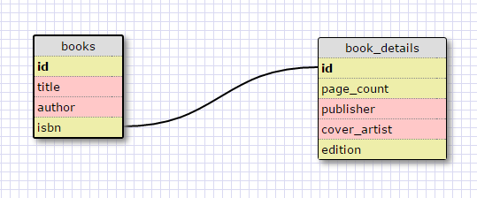
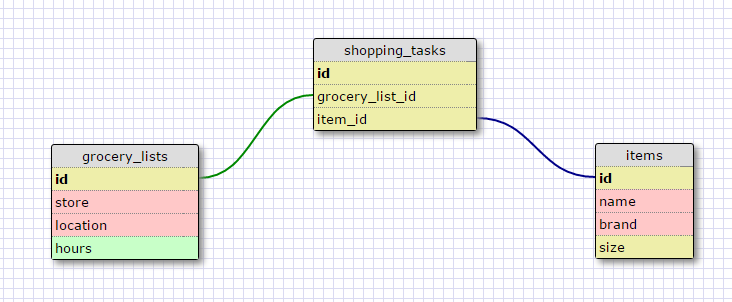

## Release 2: Create a One-to-one Schema

As an example of a one-to-one relationship, let's look at a book.
Probably the most important details are the title, author, and ISBN (which is unique for every book).
Then, a book has other details as well: the publisher, edition, page count, jacket artist, ... etc.
These can be put into a separate table (called book_details) and this table is **uniquely** associated to one row in the books table.

## Release 4: Refactor

Here is my grocery list schema

## Release 6: Reflect

*What is a one-to-one database?

A *one-to-one* relationship is a relationship between two tables where the primary key of one table associate a unique row of that table to exactly one row of the other table.

The example given in the challenge is a very good example.
For instance, France has exactly one capital - Paris
The Mayan Empire, on the other hand, had no specified capital.
The relationship between geopolitical_entities and capital_cities is a one-to-one relationship.

*When would you use a one-to-one database? (Think generally, not in terms of the example you created).

I would use a one-to-one relationship to break up bigger tables into smaller tables. This would 
make the data more compartmentalized. It would also improve the efficiency of sql queries. It would help with controlling access to data. You could allow a user to retrieve non-sensitive data about a person, but keep details such as passwords and id numbers on a separate table.

*What is a many-to-many database?

A *many-to-many* relationship is one where a row in one table is related to many rows in the other table and, conversely, 
a row in the latter table is related to many rows in the former table. Both tables are related by a join table which 
connects the two tables by keeping track of foreign keys that act to *join* the two tables.

*When would you use a many-to-many database? (Think generally, not in terms of the example you created).

Suppose you have two tables where each table has rows that can be related to many rows of the other table. 
You can use this many-to-many relationship to form a new table - the *join* table - which will give you a table all 
of whose rows are unique, but which still captures the many-to-many nature of the relationship.

*What is confusing about database schemas? What makes sense?

I don't mean to sound cocky, but database schemas don't confuse me. I view them analogously to wire-frames for a website. Before you can begin putting content into a website, you must plan how you will lay out your content.

Database schemas fulfill a similar role for data. Before you enter any data into your database, you must have some idea 
how individual pieces of data relate to one another otherwise, you could end up with a large unwieldy collection of data that is hard to access and has to be thrown out an redesigned.